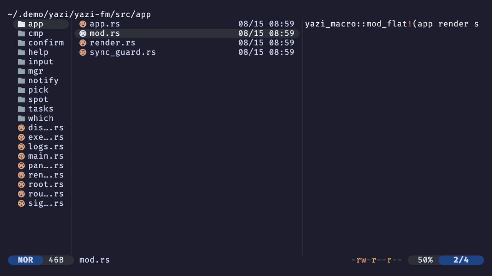

# yazi-plugins

Plugins for [Yazi](https://yazi-rs.github.io).

## Plugins

| Plugin | Description |
| --- | --- |
| [shell-peek.yazi](shell-peek.yazi) | Runs a shell command and shows its output as a notification, with logging option. |
| [better-symlinks.yazi](better-symlinks.yazi) | Shortens symlink target paths under `$HOME` to `~` in the file list. |
| [confirm-quit.yazi](confirm-quit.yazi) | Prompts `Quit?` before closing multiple tabs. |
| [count-todos.yazi](count-todos.yazi) | Shows `@todo` counts per file/directory and can open a search view of matches. |

### shell-peek.yazi



### better-symlinks.yazi


### confirm-quit.yazi


### count-todos.yazi


## Installation

Each plugin lives in its own `*.yazi/` directory. Install with:

```sh
ya pkg add alastairsounds/yazi-plugins:better-symlinks
ya pkg add alastairsounds/yazi-plugins:confirm-quit
ya pkg add alastairsounds/yazi-plugins:count-todos
ya pkg add alastairsounds/yazi-plugins:shell-peek
```
