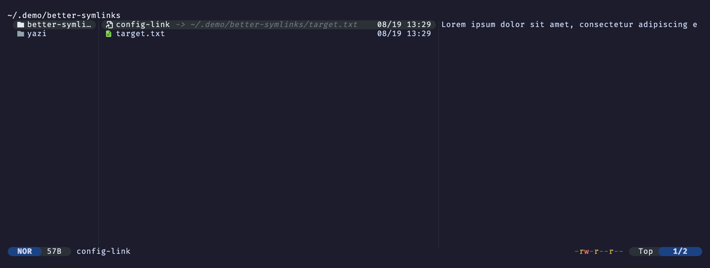

# Better Symlinks

Yazi plugin that shortens symlink target paths under `$HOME` to `~` in the file list (e.g. `-> ~/.dotfiles/yazi/init.lua` instead of the full absolute path).

## Install

```sh
ya pkg add alastairsounds/yazi-plugins:better-symlinks
```

## Setup

Add to `~/.config/yazi/init.lua`:

```lua
require("better-symlinks"):setup()
```

## Demo


