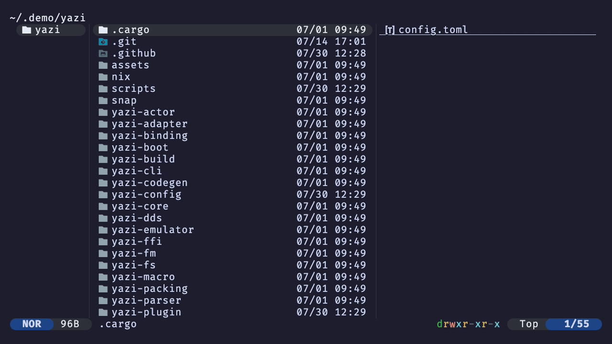

# Confirm Quit

Yazi plugin that displays the a modal to confirm quitting the application

## Install

```sh
ya pkg add alastairsounds/yazi-plugins:confirm-quit
```

## Demo

Open a second tab, then quit -- the plugin asks for confirmation instead of exiting immediately.


