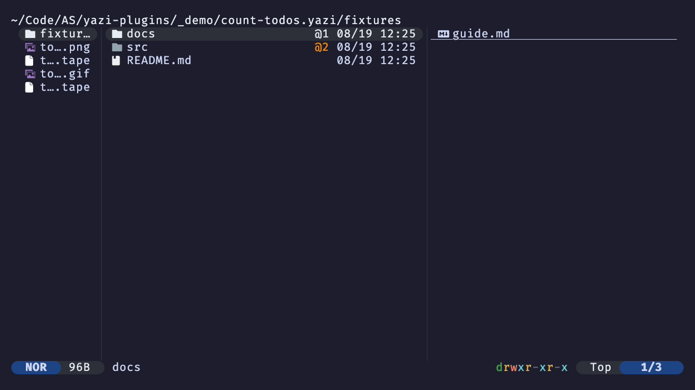

# Count Todos

Yazi plugin that shows `@todo` counts per file/directory.

## Install

```sh
ya pkg add alastairsounds/yazi-plugins:count-todos
```

## Demo

`@todo` counts roll up per file and per directory in the file list:


